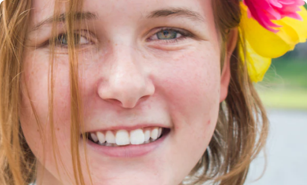
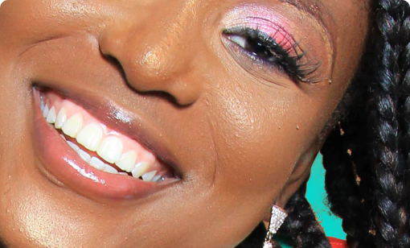

# 0. README and Objectives!

## Mandatory

This project follows the HTML, advanced project. Please ensure all tasks from the previous project are completed before continuing.

## Objective

For this project, your focus will be on CSS and the overall style of the webpage.

A design file for this project is available on Figma. Feel free to create an account to access the final design result here:

